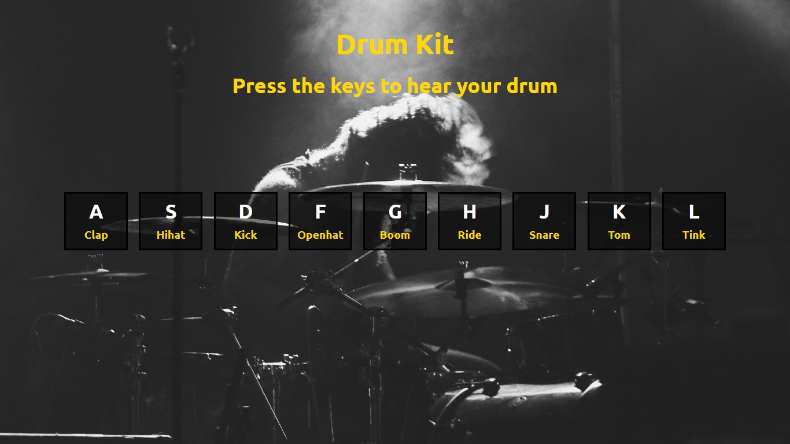
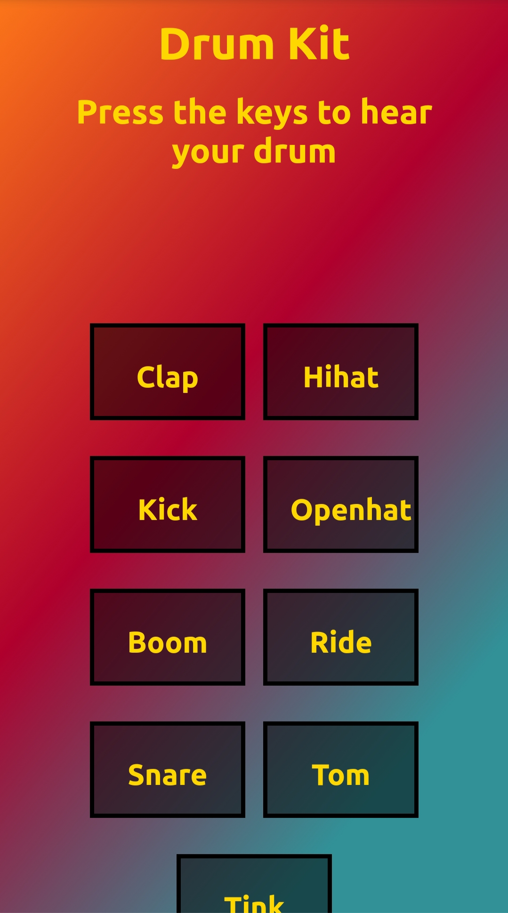

# DRUM KIT
* This is a simple JS based drum kit. Here, when you hit the corresponding key on your keyboard it's going to play the corresponding sound that is associated with the key. 
* It is full responsive and fine in both mobile phone and in big screen devices.

### Desktop View :
 

### Mobile View
 

 

## Instructions
* When using keyboard, on pressing the correct key will play the required sound.
* When using touch-based devices, on touching the correct button on the screen will play the required sound.